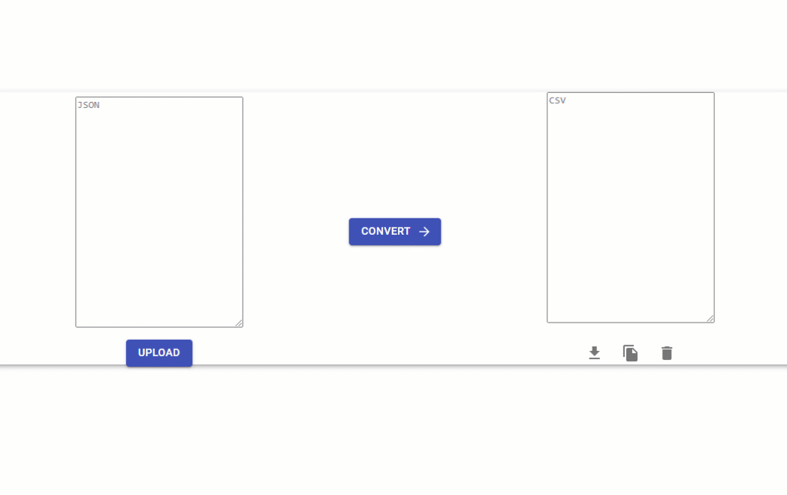
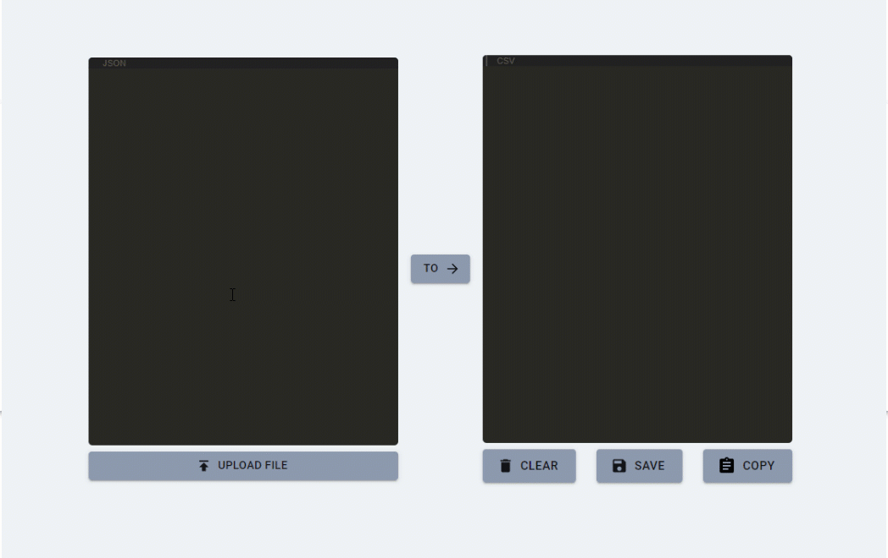

# JSON2CSV and CSV2JSON

## Compare versions

- [Old version](https://oscaramos.github.io/json2csv/) made in 9/5/2020
- [Newer version](https://json2csv.vercel.app/) made in 16/8/2020

**Tier:** 1-Beginner

Developers and end users are both experts in their own domains and as such,
each speaks using a domain-specific language and terminology. This also extends
to the tools used to manipulate data. Developers have found JSON to be a
universally accepted method for transferring data between applications. End
Users, on the other hand, rely on spreadsheets to organize and analyze data.

The objective of JSON2CSV is to help bridge the gap between JSON and CSV by
converting JSON to CSV to make it easier to review data in a spreadsheet. It
allows the user to paste JSON into a text box to generate its equivalent CSV.

### Constraints

- You may not use any libraries or packages designed to perform this type of
  conversion.
- If you choose to implement this in JavaScript don't use complicated looping
  in your first implementation. Instead, use `Object.keys()` and `Object.values`
  to generate CSV for the header and data rows.
- Nested JSON structures are not supported.

## User Stories

- [x] User can paste JSON syntax into a text box
- [x] ~~User can click a 'Convert' button to validate the JSON text box and convert it to CSV~~ Without convertion buttons
- [x] User can see the converted CSV in another text box
- [x] User can see an warning message if the JSON text box is empty or if it doesn't contain valid JSON
- [x] User can click a 'Clear' button to clear the contents of both the JSON and CSV text boxes.

## Bonus features

- [x] User can enter the path to the JSON file on the local file system in a text box
- [x] User can click a 'Open' button to load file containing the JSON into the text box
- [x] User can see a warning message if the JSON file is not found
- [x] User can enter the path the CSV file is to be saved to in a text box
- [x] User can click a 'Save' button to save the CSV file to the local file system
- [x] User can see a warning message if the CSV text box is empty or if the save operation failed.
- [x] User can convert CSV data to JSON. See CSV2JSON from AppIdeas

## Useful links and resources

- [Comma Separated Values (CSV)](https://en.wikipedia.org/wiki/Comma-separated_values)
- [JavaScript Object Notation (JSON)](https://www.json.org/)
- [MDN Javascript Object](https://developer.mozilla.org/en-US/docs/Web/JavaScript/Reference/Global_Objects/Object)
- [Saving a file with pure JS](https://codepen.io/davidelrizzo/pen/cxsGb)
- [Reading files in Javascript](https://codepen.io/jduprey/details/xbale)

## Example projects

Try to complete your JSON2CSV implementation before reviewing the example
project(s).

- [JSON to CSV Converter](https://codepen.io/JFarrow/pen/umjGF)
- [JSV Converter](https://gpaiva00.github.io/json-csv)

# Examples

## Old version

## New version

